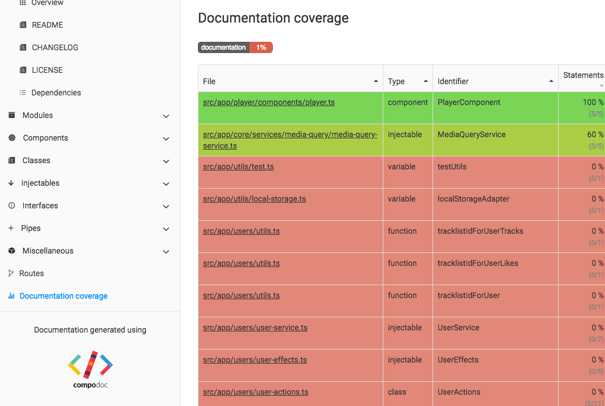

# General information

Documentation coverage is calculated only for all statement of the file, even decorators.

Private functions are not part of the calculation.

The command `--coverageTest` gives the ability to test under a CI context the level of documentation coverage.

