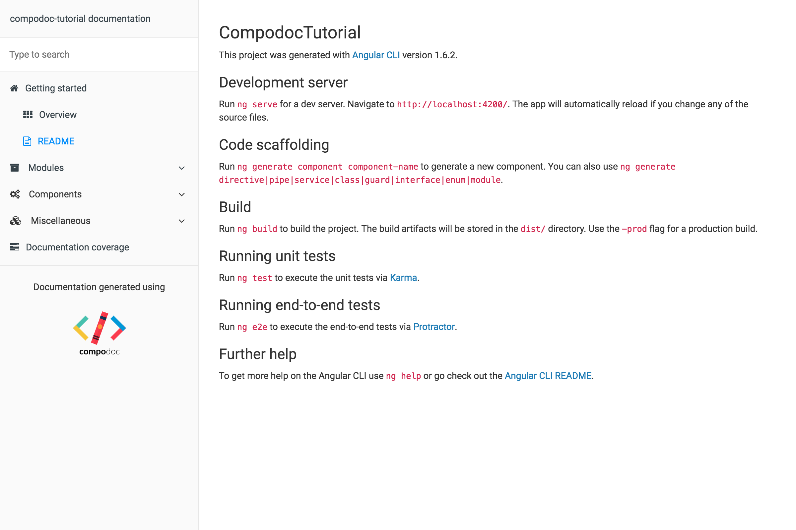

This is a simple tutorial explaining how you can document your Angular application easily with Compodoc.

We will start with a blank Angular CLI project.

# Requirements

- Angular CLI
- Node.js
- code editor or IDE

# 1. Run Angular CLI

```bash
ng new compodoc-tutorial
```

# 2. Install compodoc

```bash
npm i --save-dev @compodoc/compodoc
```

Add npm scripts inside `package.json` file for generating the documentation : on for generation, one for serving it, and another combining them :

```json
...

    "ng": "ng",
    "doc:build": "compodoc -p src/tsconfig.app.json",
    "doc:serve": "compodoc -s",
    "doc:buildandserve": "compodoc -p src/tsconfig.app.json -s",
    "start": "ng serve",

...
```

# 3. Run compodoc

```bash
npm run doc:buildandserve
```

You should see theses logs in your terminal.


and this in your browser opening http://localhost:8080



# Next steps coming soon...